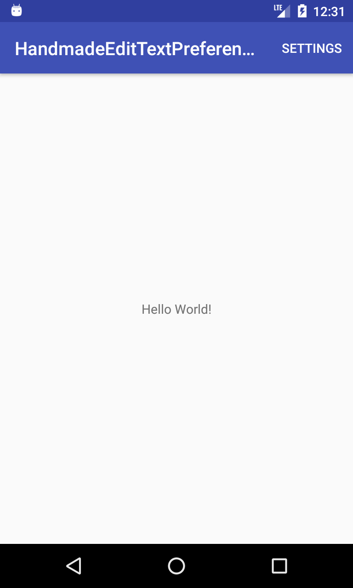
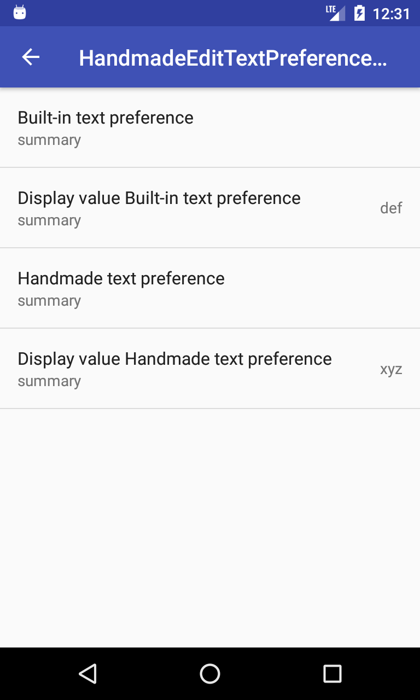
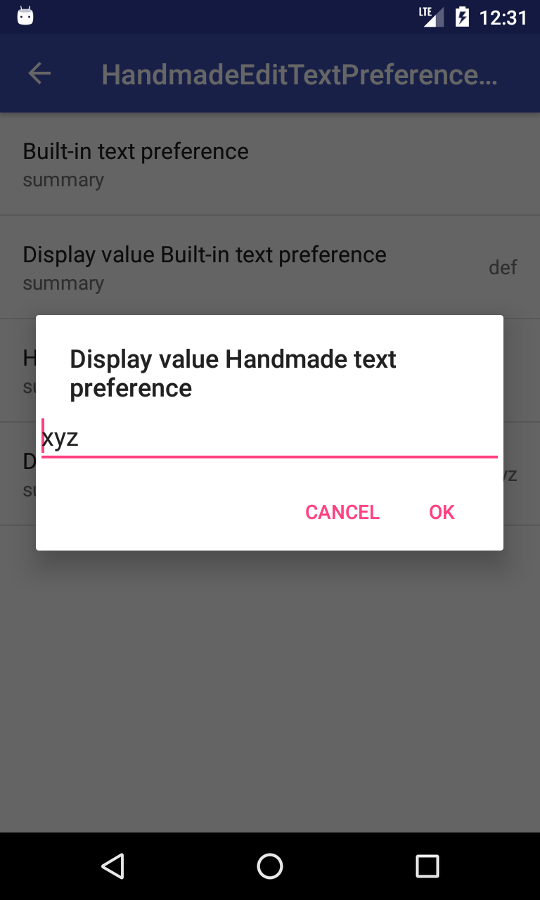
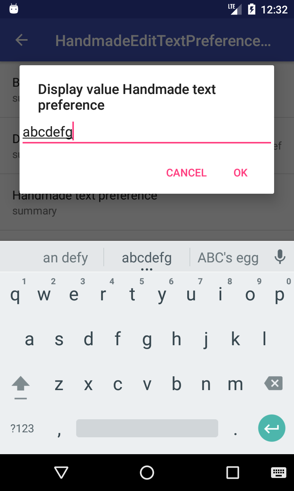
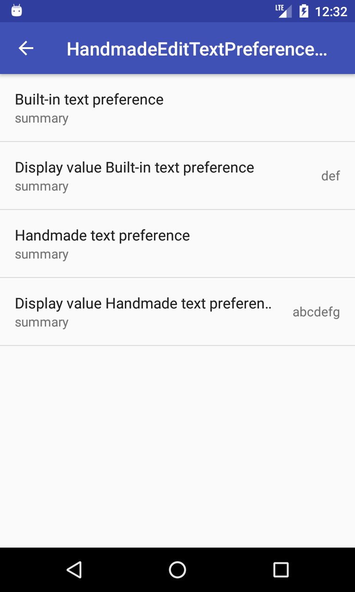

# HandmadeEditTextPreferenceTest
EditTextPreferenceと同様のダイアログを自作する方法。

要点としては、
- DialogPreferenceクラスの派生クラスを作成する。
- onCreateDialogView関数をオーバーライドし、setDialogLayoutResource関数で、自作のテキスト設定ダイアログのレイアウトを設定する。
- onBindDialogView関数をオーバーライドし、プリファレンス値の読み込みを行い、ダイアログアイテムの更新を行う。
- onDialogClosed関数をオーバーライドし、OKボタンが押された場合に、プリファレンス値の保存を行う。

## Screenshots : スクリーンショット
    

## Requirements : 必要条件、依存関係
- Android Studio 2.3.3
- Android SDK 25
- Android Build Tools v26.0.0
- Android Support Repository

## Author : 作者
Nobuki HIRAMINE : [http://www.hiramine.com](http://www.hiramine.com)

## License : ライセンス
```
Copyright 2018 Nobuki HIRAMINE

Licensed under the Apache License, Version 2.0 (the "License");
you may not use this file except in compliance with the License.
You may obtain a copy of the License at

    http://www.apache.org/licenses/LICENSE-2.0

Unless required by applicable law or agreed to in writing, software
distributed under the License is distributed on an "AS IS" BASIS,
WITHOUT WARRANTIES OR CONDITIONS OF ANY KIND, either express or implied.
See the License for the specific language governing permissions and
limitations under the License.
```
